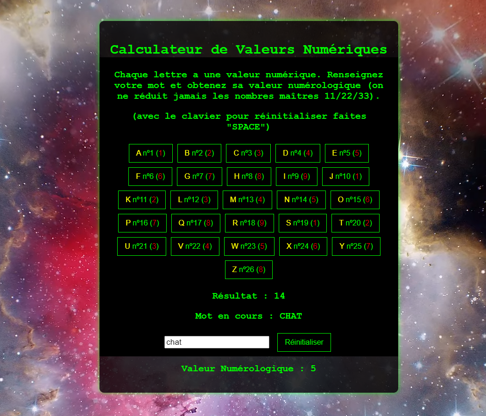

# CodeWords - Calcules la valeur numérologique d'un mot

## Description
**CodeWords** est une application destinée aux professionnels de la numérologie. Cette application permet de calculer la valeur numérologique d'un mot en temps réel. L'application est conçue pour une utilisation optimale aussi bien sur ordinateur de bureau que sur mobile, avec des fonctionnalités adaptées à chaque format.

## Fonctionnalités

- **Calcul en temps réel** : Entrez un mot et obtenez instantanément son **Résultat** et sa **Valeur Numérologique**.
- **Utilisation sur Desktop** :
  - Utilisez les touches de votre clavier physique pour entrer un mot.
  - Appuyez sur la touche `SPACE` pour réinitialiser le champ de saisie.
- **Utilisation sur Mobile** :
  - Utilisez les touches numériques à l'écran pour entrer un mot.
  - Cliquez sur le bouton `Réinitialiser` pour vider le champ de saisie.

## Calculs

- **Résultat** : La somme des valeurs numériques associées à chaque lettre du mot saisi. Par exemple, pour le mot "CHAT", le Résultat serait la somme des valeurs numériques de `C`= 3, `H` = 8, `A` = 1, et `T` = 2 (Le Résultat est 14 et sa valeur numérologique 5)
- **Valeur Numérologique** : Le résultat de la réduction pythagoricienne. La réduction pythagoricienne consiste à additionner les chiffres du Résultat jusqu'à obtenir un nombre compris entre 1 et 9, ou à conserver les nombres maîtres 11, 22, ou 33. 

## Utilisation

### Accès à l'Application

Pour utiliser l'application, que ce soit sur ordinateur ou sur mobile, rendez-vous à l'adresse suivante :  
[CodeWords - Calculateur de Valeurs Numériques](https://syu99.github.io/codeWords/).

### Mode Desktop

1. Ouvrez l'application via le lien ci-dessus sur votre ordinateur.
2. Tapez un mot en utilisant votre clavier physique.
3. Le **Résultat** et la **Valeur Numérologique** du mot seront calculés et affichés en temps réel.
4. Pour réinitialiser le champ de saisie, appuyez sur la touche `SPACE`.

### Mode Mobile

1. Ouvrez l'application via le lien ci-dessus sur votre appareil mobile.
2. Utilisez les touches numériques affichées à l'écran pour saisir un mot.
3. Le **Résultat** et la **Valeur Numérologique** du mot seront affichés automatiquement.
4. Pour réinitialiser le champ de saisie, appuyez sur le bouton `Réinitialiser`.

## Détails Techniques

- **Technologies utilisées** : HTML, CSS, JavaScript.
- **Optimisation** : L'application est optimisée pour fonctionner sur les navigateurs modernes en mode Desktop et Mobile.
- **Réinitialisation** : La réinitialisation est gérée par la touche `SPACE` sur Desktop et le bouton `Réinitialiser` sur Mobile, permettant une remise à zéro rapide du champ de saisie.

## Contribution

Si vous souhaitez contribuer à l'amélioration de cette application :

1. Clonez ce dépôt.
2. Créez une branche (`git checkout -b feature/AmazingFeature`).
3. Commitez vos changements (`git commit -m 'Add some AmazingFeature'`).
4. Poussez la branche (`git push origin feature/AmazingFeature`).
5. Ouvrez une Pull Request.

## Licence

Ce projet est sous licence MIT - voir le fichier [LICENSE](LICENSE) pour plus de détails.
